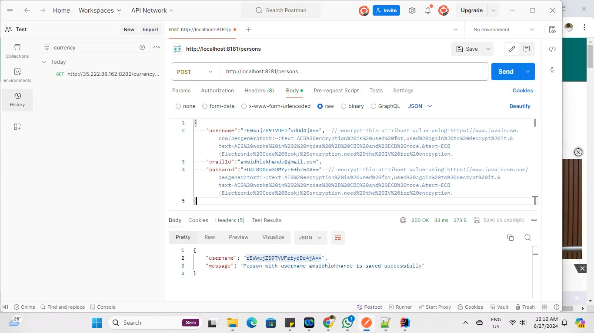

### How to call encrypted api from postman

https://www.javainuse.com/aesgenerator#:~:text=AES%20encryption%20is%20used%20for,used%20again%20to%20decrypt%20it.&text=AES%20works%20in%202%20modes%20%2D%20CBC%20and%20ECB%20mode.&text=ECB(Electronic%20Code%20Book)%20encryption,need%20the%20IV%20for%20encryption.
